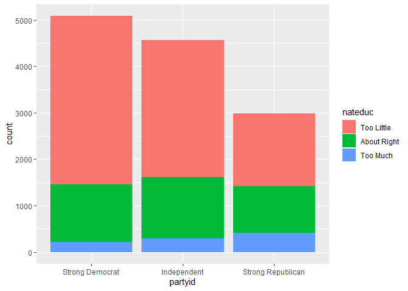

Statistical inference with the GSS data
================
Mohammad Abooei Mehrizi

## Setup

### Load packages

``` r
library(ggplot2)
library(dplyr)
library(statsr)
```

    ## Warning: package 'statsr' was built under R version 4.2.3

    ## Warning: package 'BayesFactor' was built under R version 4.2.3

    ## Warning: package 'coda' was built under R version 4.2.3

### Load data

``` r
load("gss.Rdata")
```

------------------------------------------------------------------------

## Part 1: Data

I investigated this question using GSS data set. This data was collected
from the population of United States and American society.This data was
collected using **Simple Random Sample** method, hence **Random
Sampling** is used for this project which allows us to **Generalize**
the outcome of this project to the population. Also we didn’t make use
of **Random Assignment**, so we cannot make **Causal** conclusions.

------------------------------------------------------------------------

## Part 2: Research question

Does there appear to be a relationship between **Political Party
Affiliation** and the opinion towards **Spending Money on Improving
Nation’s Education System**? This question is of interest to me because
I am willing to know if people with different political parties have the
same opinion on nation’s problems.

------------------------------------------------------------------------

## Part 3: Exploratory data analysis

First we make a new data frame that consists of the three **major
political parties** and then we delete the part we don’t know about the
**nation’s spending on education** (NA’s).

``` r
party_gss <- gss %>%
  filter(partyid == "Strong Democrat" | partyid == "Strong Republican" | partyid == "Independent")

party_gss <- party_gss %>%
  filter(!is.na(nateduc))
```

Then we make a bar plot and summary statistics of our data in order to
know what kind of inference we are going to use.

``` r
ggplot(data = party_gss , aes(x = partyid , fill = nateduc)) + 
  geom_bar()
```

<!-- -->

``` r
party_gss %>%
  group_by(partyid , nateduc) %>%
  summarise(count=n())
```

    ## `summarise()` has grouped output by 'partyid'. You can override using the
    ## `.groups` argument.

    ## # A tibble: 9 × 3
    ## # Groups:   partyid [3]
    ##   partyid           nateduc     count
    ##   <fct>             <fct>       <int>
    ## 1 Strong Democrat   Too Little   3636
    ## 2 Strong Democrat   About Right  1229
    ## 3 Strong Democrat   Too Much      222
    ## 4 Independent       Too Little   2960
    ## 5 Independent       About Right  1323
    ## 6 Independent       Too Much      288
    ## 7 Strong Republican Too Little   1562
    ## 8 Strong Republican About Right  1000
    ## 9 Strong Republican Too Much      418

------------------------------------------------------------------------

## Part 4: Inference

Since we want to know the relationship between the two discussed
subject, we are going to perform a **Chi_Square Independence Test**.

**Hypotheses**:

H0: Political party affiliation and opinion towards spending money on
improving nation’s education system are **Independent**.

HA: Political party affiliation and opinion towards spending money on
improving nation’s education system are **Dependent**.

**Conditions**:

1_Independence:

Random sample is used.

Sampling is without replacement and n=12638 is smaller than 10% of the
population (which is US population).

each case only contributes to one cell in the table

2_Sample size:

Each particular scenario (cell) at least has 5 expected cases.

**Method**:

Our sample size is big enough and conditions are met, so we can use
**theoretical method** (CLT based) for the hypothesis test.

**Perform inference**:

Now we can perform the chi_square independence test.

``` r
chisq.test(party_gss$partyid , party_gss$nateduc)
```

    ## 
    ##  Pearson's Chi-squared test
    ## 
    ## data:  party_gss$partyid and party_gss$nateduc
    ## X-squared = 416.18, df = 4, p-value < 2.2e-16

**Interpret results**:

We are dealing with two categorical variables with more than 2 levels,
which makes us able to perform a chi_square independence test.

As we can see, the test gives us a pretty small p_value (2.2e-16). Bases
on this p_value, we **reject** the null hypothesis, meaning that
political party affiliation and opinion towards spending money on
improving nation’s education system are **Dependent**.

It is important to know that when we are working with chi_square test or
ANOVA, we cannot calculate a **confidence interval** since we are not
estimating a population parameter.
